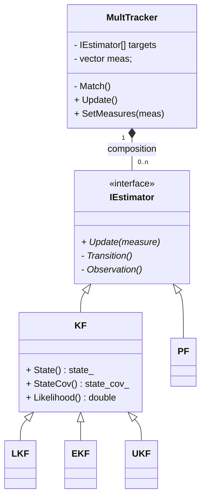

# Multi-Target Traciking

```mermaid
classDiagram

IEstimator <|-- KF
KF <|-- LKF
KF <|-- EKF
KF <|-- UKF
IEstimator <|-- PF

MultTracker "1" *-- "0..n" IEstimator : composition

class MultTracker {
    - IEstimator[] targets
    - vector meas; 
    - Match()
    + Update()
    + SetMeasures(meas)
}

<<interface>> IEstimator
class IEstimator {
    + Update(measure)*
    - Transition()*
    - Observation()*
}

class KF {
    + State() state_
    + StateCov() state_cov_
    + Likelihood() double
}
```